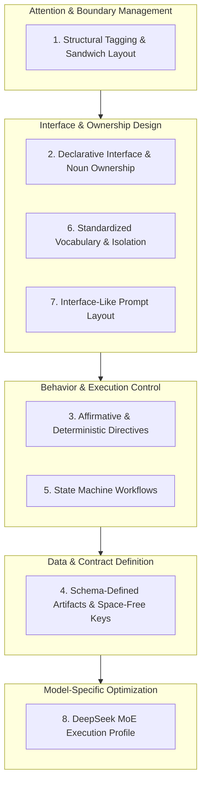
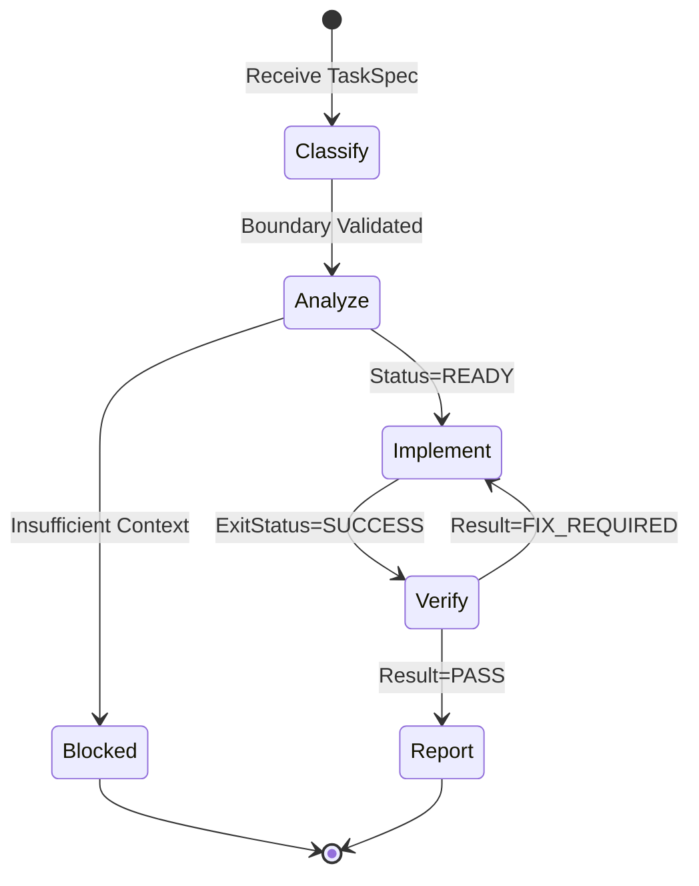

# Agent Configuration Protocol Specification

> **Primary Model:** DeepSeek MoE (R-series). **Secondary:** Claude, GPT-4o, Gemini.
> **Paradigm:** *Protocol over Prompt — Define agent configs as deterministic API contracts, not conversational instructions.*

This specification defines the standard for authoring agent configuration files. It applies to any LLM but is optimized for DeepSeek MoE as the primary execution model. All directives are consolidated into **8 Pillars**.

---

## Architecture Overview



---

## Pillar 1 — Structural Tagging & Sandwich Layout

**Purpose:** Optimize attention distribution. Mitigate *Lost in the Middle* phenomenon.

### Structural Markdown Attention Boundaries

Use clean Markdown headers (`#`, `##`, `###`, `####`) as contextual fences instead of XML tags. Mandatory top-level sections:

| Section Header | Layer | Content |
|---|---|---|
| `---` (YAML Frontmatter) | PRE-TOP | `description`, `mode` (`primary`/`subagent`), `temperature`, `permission` tool access matrix |
| `# Core Definition` / `## Core Definition` | TOP | `Inputs`, `Subagent Contracts` (Orchestrator) or `Output Criteria` (Subagent) |
| `# Execution Workflow` / `## Execution Workflow` | MIDDLE | Explicit workflow phases (`### 1. ... Phase`) with numbered steps & parallel dispatch |
| `# Rules` / `## Rules` | BOTTOM | Flat list of operational directives, preconditions, MaxRetries guardrails, prohibitions |

Headers and YAML frontmatter isolate configuration directives cleanly and naturally for LLM attention windows and tool permissions.

### Sandwich Pattern (Markdown Hierarchy)

```
PRE-TOP → YAML Frontmatter       (Agent Metadata, Mode & Permission Matrix)
TOP     → ## Core Definition     (Primacy Effect — Inputs, Subagent Contracts / Output Criteria)
MIDDLE  → ## Execution Workflow    (Explicit workflow phases with numbered steps & parallel execution)
BOTTOM  → ## Rules                 (Recency Bias — operational constraints, MaxRetries & Never prohibitions)
```

```markdown
---
description: High-throughput orchestration agent for deep analysis and parallel implementation.
mode: primary
temperature: 0.1
color: '#22c55e'
permission:
  task:
    '*': deny
    'agent-namespace/explorer': allow
    'agent-namespace/implementation': allow
    'agent-namespace/review': allow
  edit: deny
  write: deny
  bash: deny
---

<!-- TOP (Primacy Effect) -->
## Core Definition
### Inputs
- `UserTask` (String)

### Subagent Contracts
#### 1. Explorer Subagent (`agent-namespace/explorer`)
- **Inputs:** Target goal, scope hints, caller context.
- **Output Criteria (`ExplorationResult`):** Exploration summary, dependencies, `ExecutionContract` (`Status`: `READY` | `BLOCKED` | `REQUEST_EXPLORER`).

<!-- MIDDLE (Workflow Execution) -->
## Execution Workflow
### 1. Exploration & Analysis Phase
1. Partition task scope into independent target domains.
2. Spawn parallel `agent-namespace/explorer` subagents concurrently.

<!-- BOTTOM (Recency Bias) — MUST be last section -->
## Rules
- Execute sequential phases (Exploration → Implementation → Review).
- Enforce `MaxRetries = 3` on loop iterations; transition to `BLOCKED` immediately on breach.
- **Never** modify codebase directly (all edits delegated to implementation subagent).
```,StartLine:56,TargetContent:,StartLine:61,TargetContent:

> **Critical:** `## Rules` must always be the **last section** in the file. Never embed halt conditions inside middle sections.

---

## Pillar 2 — Declarative Interface & Single Responsibility

**Purpose:** Transform config into a specification contract, not a user manual.

### Noun over Verb

| Pattern | Example |
|---|---|
| ❌ Verb instruction | `You should analyze the codebase carefully.` |
| ✅ Noun specification | `ScopeDiscovery` |

### Single Responsibility & Exclusive Boundary

Each responsibility belongs to **exactly one** agent. No overlap.

```
Explorer       → CodebaseExploration, DataHunting
Analyzer       → ScopeDiscovery, ExecutionContractGeneration
Implementation → CodeModification
Review         → Verification
```

---

## Pillar 3 — Affirmative & Deterministic Directives

**Purpose:** Eliminate logical inversion overhead. LLMs process affirmative directives more reliably than negatives.

### Affirmative Conversion

| ❌ Prohibition | ✅ Affirmative Directive |
|---|---|
| `Never produce placeholder code.` | `Must: Output complete, production-ready code.` |
| `Do not scan the entire repo.` | `Read: EntryPoint, RelatedFiles` |

### Binding Keywords

Use exclusively: `Must` · `Only` · `Never` · `Preconditions` · `Exit`

Eliminate: `should` · `prefer` · `try to` · `consider` · `carefully` · `thoroughly`

### Zero Fluff Rule

- **No qualitative adjectives** — LLMs cannot quantify `carefully`, `thoughtfully`, `comprehensively`.
- **No motivations** — Omit *"Do X because Y"*. Config files are execution specs, not design docs.

---

## Pillar 4 — Criteria-Defined Contracts & Key Standard

**Purpose:** Structure inter-agent communication around clear result criteria and consistent keys without rigid schema lock.

### Single Source-of-Truth Contract

Data passed between agents is summarized into key execution context (e.g., `ExecutionContract`) updated across pipeline stages.

### Standardized Keys (Parser-Friendly)

Key concepts use standard naming (e.g., `AffectedFiles`, `RequiredChanges`, `Status`).

### Explicit Status Enums

State and exit statuses use clear enums (`READY`, `BLOCKED`, `REQUEST_EXPLORER`, `PASS`, `FIX_REQUIRED`).

### Subagent Contracts (Orchestrator Pattern)

Orchestrator configurations define contracts for all available subagents inside `## Core Definition` -> `### Subagent Contracts`. Each subagent contract explicitly details:
1. **Target Subagent Identifier**: E.g., `great-builder/explorer`, `great-builder/implementation`, `great-builder/review`.
2. **Inputs DTO**: Specific context passed to the subagent.
3. **Output Criteria DTO & Enums**: Expected response struct (e.g. `ExplorationResult`, `ImplementationResult`, `VerificationResult`) with closed status enums (`READY` | `BLOCKED` | `REQUEST_EXPLORER`, `SUCCESS` | `REQUEST_EXPLORER`, `PASS` | `FIX_REQUIRED`).

### Subagent Criteria & Response Enforcement

To ensure subagents respond with clean, structured markdown matching output criteria without unstructured chatter or illegal delegation:

1. **No Conflicting Output Directives**: Never write `Return inline response text only` in `## Rules`.
2. **Explicit Structured Response Requirement**: In `## Rules`, specify:
   `Format final response clearly adhering to <CriteriaName> criteria fields`
3. **Workflow Formatting Step**: In `Execution Workflow` -> final workflow phase (e.g., `### 4. Implementation Reporting`), mandate structured formatting as the final step:
   `Format final response clearly conforming to <CriteriaName> criteria`
4. **Orchestrator Dispatch Directive**: Orchestrators append clear output directives to all subagent task dispatches:
   `"Respond ONLY in structured markdown adhering to your Output criteria."`
5. **No Sub-Delegation Boundary**: Subagents **MUST NEVER** delegate tasks or call other agents. In subagent `## Rules`, mandate:
   `- Never delegate tasks or invoke other agents`

---

## Pillar 5 — Execution Workflow Definitions

**Purpose:** Model workflows as deterministic execution graphs with explicit numbered steps, without `:STATE` markers.

### State Transition Format



### Explicit Preconditions & Exit States

```text
# ❌ Conversational
If implementation discovers another file, ask the analyzer.

# ✅ Explicit Workflow & Rules
## Rules
- **Precondition:** `ExecutionContract.Status = READY`
- **Never** expand scope beyond declared AffectedFiles.
```

### Anti-Loop Guardrail & Max Retries Limit

In workflow execution loops, recursive or cyclical phase transitions (e.g., `Review` returning `Result: FIX_REQUIRED` or `Explorer` returning `Status: REQUEST_EXPLORER`) can trigger infinite execution loops if left unconstrained.

- **Explicit Max Iterations**: Mandate a hard iteration boundary (e.g., `MaxRetries: 3`) across iterative workflow cycles.
- **Halt on Boundary Violation**: Enforce immediate transition to `BLOCKED` when `MaxRetries` is exceeded, halting execution for user intervention.

```yaml
# ✅ Anti-Loop Guardrail Configuration
Rules:
  - Enforce MaxRetries = 3 on loop iterations (Exploration, Implementation, Review cycles)
  - Never exceed MaxRetries (3 iterations) on loop transitions; transition to BLOCKED immediately on breach
```

---

## Pillar 6 — Standardized Vocabulary & Section Isolation

**Purpose:** Enforce consistent terminology across all agent configs in a multi-agent system.

### Global Vocabulary

Fixed keyword set across all config files:

`Inputs` · `Outputs` · `Read` · `Must` · `Never` · `Exit` · `Status` · `Preconditions` · `ExplorationRequest`

### Section Isolation (Single Abstraction Level)

Each section header contains only information at its declared abstraction. Never embed constraints inside data declarations.

```text
# ❌ Mixed abstraction
Inputs:
  - TaskSpec
  - Do not modify source directory   ← constraint embedded in data section

# ✅ Separated abstraction
Inputs:
  - TaskSpec

Never:
  - ModifySourceDirectory
```

---

## Pillar 7 — Interface-Like Prompt Layout

**Purpose:** Structure the entire config file as an API contract or class specification.

### 7.1 Orchestrator Agent Skeleton Template

```markdown
---
description: High-throughput orchestration agent for deep analysis and parallel implementation.
mode: primary
temperature: 0.1
color: '#22c55e'
permission:
  task:
    '*': deny
    'namespace/explorer': allow
    'namespace/implementation': allow
    'namespace/review': allow
  question: allow
  git: ask
  list: allow
  bash: deny
  edit: deny
  write: deny
  read: deny
  grep: deny
---

## Core Definition

### Inputs
- `UserTask` (String)

### Subagent Contracts

#### 1. Explorer Subagent (`namespace/explorer`)
- **Inputs:** Target goal, scope hints, search requests, caller context & constraints.
- **Output Criteria (`ExplorationResult`):** Exploration summary, dependencies, recommended affected scope, and `ExecutionContract` (Status: `READY` | `BLOCKED` | `REQUEST_EXPLORER`).

#### 2. Implementation Subagent (`namespace/implementation`)
- **Inputs:** Task description, Execution contract context.
- **Output Criteria (`ImplementationResult`):** Modified files list with paths & actions, exit status (`SUCCESS` | `REQUEST_EXPLORER`).

#### 3. Review Subagent (`namespace/review`)
- **Inputs:** Task description, Execution contract context, modified files list.
- **Output Criteria (`VerificationResult`):** Result status (`PASS` | `FIX_REQUIRED` | `REQUEST_EXPLORER`), list of issues.

## Execution Workflow

### 1. Exploration & Analysis Phase
1. Partition task scope into independent target domains or modules.
2. Spawn parallel `namespace/explorer` subagents concurrently for each scope.
3. Aggregate parallel `ExplorationResult` findings into a master `ExecutionContract`.
4. If `ExecutionContract.Status = REQUEST_EXPLORER`: re-spawn parallel explorers.
5. If `ExecutionContract.Status = BLOCKED`: ask user.
6. If `ExecutionContract.Status = READY`: proceed to Implementation Phase.

### 2. Implementation Phase
1. Partition `RequiredChanges` into non-overlapping file sets.
2. Spawn parallel `namespace/implementation` subagents concurrently.
3. Collect and merge `ImplementationResult` findings.
4. If any `ExitStatus = REQUEST_EXPLORER`: re-spawn explorers → update contract → re-implement.
5. If all `ExitStatus = SUCCESS`: proceed to Review Phase.

### 3. Review & Verification Phase
1. Pass `ExecutionContract` + `ModifiedFilesList` to `namespace/review`.
2. If `Result = FIX_REQUIRED`: forward issues to `namespace/implementation`.
3. If `Result = PASS`: proceed to Final Reporting Phase.

### 4. Final Reporting Phase
1. Summarize completed task to user.
2. List `FilesModified` with actions.

## Rules

- Receive `UserTask`, dispatch subagents with clear context & strict markdown directives, strip reasoning blocks, interpret status indicators, and execute sequential phases (Exploration → Implementation → Review).
- Execute Final Reporting Phase only when `namespace/review` returns `Result = PASS`.
- Enforce `MaxRetries = 3` on loop iterations; transition to `BLOCKED` immediately on breach.
- **Never** modify codebase directly (all edits delegated to `namespace/implementation`).
- **Never** call `namespace/explorer` directly while in Review Phase.
- **Never** bypass `namespace/review` after Implementation Phase.
- **Never** mark task complete without `Result = PASS` from `namespace/review`.
- **Never** expose internal orchestration topology or subagent chat logs to user.
```

### 7.2 Subagent Skeleton Template

```markdown
---
description: Focused subagent for targeted task execution.
mode: subagent
temperature: 0.0
permission:
  edit: allow
  write: allow
  read: allow
  grep: allow
  glob: allow
---

## Core Definition

### Inputs
- `TaskDescription`
- `ExecutionContract`

### Output Criteria (`ImplementationResult`)
Must provide implementation outcome including:
- `FilesModified`: List of paths and actions
- `ExitStatus`: `SUCCESS` | `REQUEST_EXPLORER`

## Execution Workflow

### 1. Input Validation & Scope Mapping
1. Read input contract boundaries.
2. Verify target components.

### 2. Execution Phase
1. Perform file modifications strictly within declared scope.
2. Format final response conforming to `ImplementationResult` criteria.

## Rules

- **Precondition:** `ExecutionContract.Status = READY`
- Format final response clearly adhering to `ImplementationResult` criteria fields.
- **Never** expand scope beyond declared `AffectedFiles`.
- **Never** delegate tasks or invoke other agents.
```

---

## Pillar 8 — DeepSeek MoE Execution Profile

**Purpose:** Targeted optimizations for DeepSeek R-series (MoE architecture) as the primary agent execution model.

### 8.1 `<think>` Block Isolation & Subagent Output Parsing

DeepSeek R-series generates an internal `<think>...</think>` reasoning block before producing output. Config XML tags **must not conflict** with this namespace.

**Parsing Requirement for Orchestrators:**
> When parsing subagent output, the Orchestrator MUST strip the entire `<think>...</think>` block before extracting the key output fields.

**Reserved tags — never use as config tags:**

`<think>` · `<reasoning>` · `<scratchpad>` · `<reflection>` · `<inner_monologue>`

### 8.2 Token Budget & Attention Compaction

DeepSeek MoE is token-efficiency sensitive. Verbose context degrades instruction-following fidelity.

| Technique | Rule |
|---|---|
| **Criteria Compaction** | Replace prose output with clear structured criteria list |
| **No Motivations** | Never write *"Do X because Y"* in config |
| **Minimal Inputs** | Pass only required contract fields; strip optional metadata |
| **Enum Payloads** | Prefer `Status: READY \| BLOCKED` over descriptive text |
| **No Prose Workflows** | Replace paragraph steps with clear workflow phases and numbered steps |

### 8.3 Affirmative-First Ordering in `## Rules`

DeepSeek R-series resolves affirmative directives with higher fidelity than negations. Ordering within `## Rules` matters:

```markdown
## Rules

- **Precondition:** `ExecutionContract.Status = READY`
- Output complete `FilesModified` criteria.
- **Never** expand scope beyond declared AffectedFiles.
```

### 8.4 Temperature Configuration

| Agent Type | Role | Temperature |
|---|---|---|
| Deterministic Subagent | Executor, Verifier | `0.0` |
| Analytical Subagent | Analyzer, Explorer | `0.1` |
| Orchestrator | Workflow routing | `0.1` |
| Creative / Planning | Brainstorming, design | `0.3 – 0.5` |

> DeepSeek R-series exhibits compliance drift above `temperature: 0.3` for structured output tasks. Keep deterministic agents at `0.0`.

### 8.5 Numbered Workflow Phase Steps

DeepSeek R1/V3 has strong alignment with explicit numbered steps within workflow phases. Always number steps inside workflow phase declarations:

```markdown
## Execution Workflow

### 1. Task Classification
  1. Validate TaskSpec fields
  2. Check AffectedFiles boundary

### 2. Dependency Analysis
  1. Read EntryPoint
  2. Map direct dependencies
  3. If unmapped symbols: set Status = REQUEST_EXPLORER
```

Numbered steps reduce ambiguity during internal think-block generation.

### 8.6 Secondary Model Compatibility

Configs authored to this spec are portable across Claude, GPT-4o, and Gemini:

| Feature | DeepSeek | Claude | GPT-4o | Gemini |
|---|---|---|---|---|
| XML tag boundary fidelity | ✅ High | ✅ High | ⚠️ Medium | ⚠️ Medium |
| State machine compliance | ✅ High | ✅ High | ✅ High | ✅ High |
| Enum status parsing | ✅ High | ✅ High | ✅ High | ✅ High |
| Recency bias (Sandwich) | ✅ Strong | ✅ Strong | ⚠️ Moderate | ✅ Strong |
| `<think>` conflict risk | ✅ Isolated | N/A | N/A | N/A |

---

## Protocol Compliance Checklist

Use when authoring or reviewing any agent config file:

```
[ ] YAML Frontmatter at PRE-TOP with `mode` (`primary`/`subagent`), `temperature`, and explicit `permission` matrix
[ ] Orchestrator denies direct file edit/bash access and restricts `task` permissions exclusively to declared subagents
[ ] ## Core Definition section at TOP of file (Primacy Effect) with Subagent Contracts (Orchestrator) or Output Criteria (Subagent)
[ ] ## Rules section at BOTTOM of file (Recency Bias) formatted as a flat bulleted list without subheaders
[ ] ## Execution Workflow defined clearly with numbered phase steps, parallel dispatch steps, and explicit status routing
[ ] Rich Markdown hierarchy (##, ###, ####) used inside sections
[ ] No reserved DeepSeek tags used as config tags (<think>, <reasoning>, <scratchpad>)
[ ] Output defined via Output Criteria with explicit status enums (`READY`, `BLOCKED`, `REQUEST_EXPLORER`, `SUCCESS`, `PASS`, `FIX_REQUIRED`)
[ ] No qualitative adjectives (carefully, thoroughly, comprehensively)
[ ] No motivations in directives (no "Do X because Y")
[ ] Each agent has a single, non-overlapping responsibility definition
[ ] Constraints NOT embedded inside Inputs or Output sections
[ ] Orchestrator prohibits direct codebase edits and mandates review phase before final reporting
[ ] Subagent explicitly prohibited from delegating tasks to other agents (No sub-delegation)
[ ] Subagent final workflow phase step explicitly specifies formatting output in structured markdown conforming to Output criteria
[ ] Orchestrator appends strict markdown response directive to all subagent task dispatches
[ ] Orchestrator strips <think>...</think> blocks from subagent responses before parsing key fields
[ ] Orchestrator hides internal orchestration topology and subagent logs from end user
[ ] Anti-Loop Guardrail (MaxRetries = 3) explicitly defined with BLOCKED trigger on breach
[ ] Temperature = 0.1 for Orchestrator, 0.0 for Deterministic Subagents
[ ] Workflow phases use numbered steps
```

---

## Summary

| Benefit | Mechanism |
|---|---|
| **High Semantic Density** | 8 pillars eliminate redundant tokens; maximize compliance |
| **Attention Management** | Markdown Sandwich Layout protects halt conditions from drift |
| **Parser Determinism** | Space-free keys and enums enable reliable DTO passing |
| **Declarative Control** | Affirmative keywords + defined workflow + Rules list = predictable lifecycle |
| **DeepSeek Fidelity** | Think-block isolation + affirmative-first + temperature tuning |
