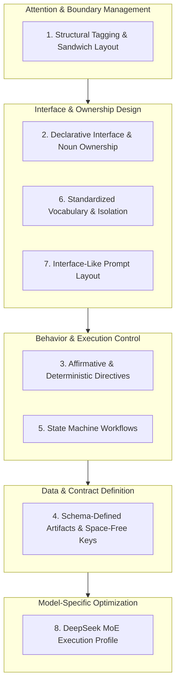
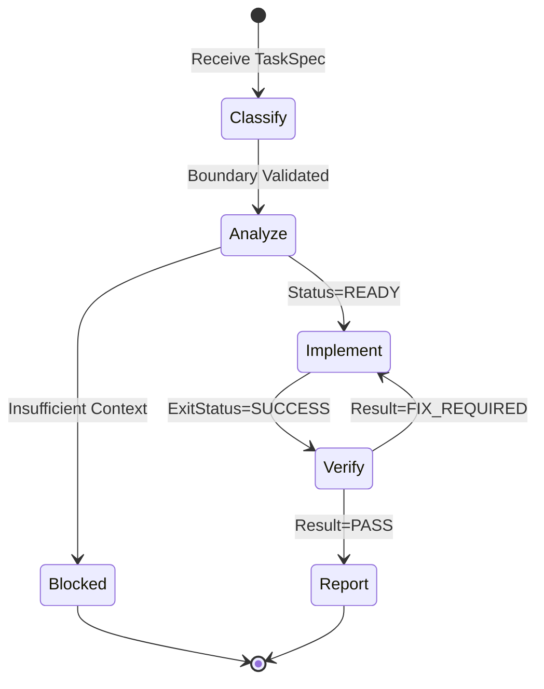

# Agent Configuration Protocol Specification

> **Primary Model:** DeepSeek MoE (R-series). **Secondary:** Claude, GPT-4o, Gemini.
> **Paradigm:** *Protocol over Prompt — Define agent configs as deterministic API contracts, not conversational instructions.*

This specification defines the standard for authoring agent configuration files. It applies to any LLM but is optimized for DeepSeek MoE as the primary execution model. All directives are consolidated into **8 Pillars**.

---

## Architecture Overview



---

## Pillar 1 — Structural Tagging & Sandwich Layout

**Purpose:** Optimize attention distribution. Mitigate *Lost in the Middle* phenomenon.

### XML Attention Boundaries

Use concise XML tags as contextual fences. Mandatory tags:

| Tag | Layer | Content |
|---|---|---|
| `<identity>` | TOP | `Role`, `Owns` declarations |
| `<core_directives>` | MIDDLE | `Inputs`, `Read`, `Output` schemas |
| `<execution_define>` | MIDDLE | State machine, workflows, DTOs |
| `<critical_constraints>` | BOTTOM | `Preconditions`, `Must`, `Never`, `Exit` |

Tags isolate configuration directives from model internal reasoning (e.g., DeepSeek `<think>` blocks).

### Sandwich Pattern

```
TOP    → <identity>              (Primacy Effect — highest recall)
MIDDLE → <core_directives>
         <execution_define>       (Logic & DTO definitions)
BOTTOM → <critical_constraints>  (Recency Bias — halt conditions)
```

```xml
<!-- TOP (Primacy Effect) -->
<identity>
Role: Code Implementation Agent
Owns: CodeModification
</identity>

<!-- MIDDLE (Technical Details & Workflow) -->
<execution_define>
STATE: CLASSIFY
  - Validate contract
STATE: IMPLEMENT
  - Execute AffectedFiles
</execution_define>

<!-- BOTTOM (Recency Bias) — MUST be last block -->
<critical_constraints>
Preconditions:
  - ExecutionContract.Status = READY
Must:
  - Output complete FilesModified DTO
Never:
  - ExpandScope
Exit:
  - SUCCESS
  - REQUEST_ANALYZER
</critical_constraints>
```

> **Critical:** `<critical_constraints>` must always be the **last block** in the file. Never embed halt conditions inside middle sections.

---

## Pillar 2 — Declarative Interface & Noun-Based Ownership

**Purpose:** Transform config into a specification contract, not a user manual.

### Noun over Verb

| Pattern | Example |
|---|---|
| ❌ Verb instruction | `You should analyze the codebase carefully.` |
| ✅ Noun ownership | `Owns: ScopeDiscovery` |

### Single Responsibility & Exclusive Ownership

Each responsibility belongs to **exactly one** agent. No overlap.

```
Explorer       → Owns: CodebaseExploration, DataHunting
Analyzer       → Owns: ScopeDiscovery, ExecutionContractGeneration
Implementation → Owns: CodeModification
Review         → Owns: Verification
```

---

## Pillar 3 — Affirmative & Deterministic Directives

**Purpose:** Eliminate logical inversion overhead. LLMs process affirmative directives more reliably than negatives.

### Affirmative Conversion

| ❌ Prohibition | ✅ Affirmative Directive |
|---|---|
| `Never produce placeholder code.` | `Must: Output complete, production-ready code.` |
| `Do not scan the entire repo.` | `Read: EntryPoint, RelatedFiles` |

### Binding Keywords

Use exclusively: `Must` · `Only` · `Never` · `Preconditions` · `Exit`

Eliminate: `should` · `prefer` · `try to` · `consider` · `carefully` · `thoroughly`

### Zero Fluff Rule

- **No qualitative adjectives** — LLMs cannot quantify `carefully`, `thoughtfully`, `comprehensively`.
- **No motivations** — Omit *"Do X because Y"*. Config files are execution specs, not design docs.

---

## Pillar 4 — Schema-Defined Artifacts & Space-Free Keys

**Purpose:** Structure inter-agent data as parseable DTOs.

### Single Source-of-Truth Contract

Data passed between agents is serialized into one artifact (e.g., `ExecutionContract`) updated across pipeline stages.

### Space-Free Keys (Parser-Friendly)

Keys must use PascalCase or camelCase. No spaces.

| ❌ Natural Language Key | ✅ DTO Key |
|---|---|
| `Affected Files: ...` | `AffectedFiles: ...` |
| `Required Changes: ...` | `RequiredChanges: ...` |
| `Status: Looks good` | `Status: PASS` |

### Strict Status Enums

```yaml
# ❌ Incorrect
Status: Looks good to proceed

# ✅ Correct
Status: PASS | FIX_REQUIRED | BLOCKED
```

---

## Pillar 5 — State Machine Workflows

**Purpose:** Model workflows as deterministic state graphs, not sequential paragraphs.

### State Transition Format



### Explicit Preconditions & Exit States

```text
# ❌ Conversational
If implementation discovers another file, ask the analyzer.

# ✅ State Machine
Preconditions:
  - ExecutionContract.Status = READY
Never:
  - ExpandScope
Exit:
  - SUCCESS
  - REQUEST_ANALYZER
  - BLOCKED
```

---

## Pillar 6 — Standardized Vocabulary & Section Isolation

**Purpose:** Enforce consistent terminology across all agent configs in a multi-agent system.

### Global Vocabulary

Fixed keyword set across all config files:

`Inputs` · `Outputs` · `Read` · `Owns` · `Must` · `Never` · `Exit` · `Status` · `Preconditions` · `ExplorationRequest`

### Section Isolation (Single Abstraction Level)

Each section header contains only information at its declared abstraction. Never embed constraints inside data declarations.

```text
# ❌ Mixed abstraction
Inputs:
  - TaskSpec
  - Do not modify source directory   ← constraint embedded in data section

# ✅ Separated abstraction
Inputs:
  - TaskSpec

Never:
  - ModifySourceDirectory
```

---

## Pillar 7 — Interface-Like Prompt Layout

**Purpose:** Structure the entire config file as an API contract or class specification.

### Canonical Skeleton Template

```xml
<identity>
Role: [AgentName]
Owns: [PrimaryResponsibility]
</identity>

<core_directives>
Inputs:
  - TaskSpec
  - EntryPoint

Read:
  - EntryPoint
  - RelatedFiles

Output:
  ExecutionContract:
    Status: READY | BLOCKED | REQUEST_EXPLORER
    AffectedFiles: Array<String>
    RequiredChanges: String
</core_directives>

<execution_define>
STATE: CLASSIFY
  1. Identify task boundary
  2. Validate scope

STATE: ANALYZE
  1. Map dependencies
  2. Identify edge cases
</execution_define>

<critical_constraints>
Preconditions:
  - Status = PENDING

Must:
  - Read EntryPoint prior to ScopeDiscovery
  - Output complete ExecutionContract DTO

Never:
  - ExpandScope
  - ModifyCode

Exit:
  - READY
  - BLOCKED
</critical_constraints>
```

---

## Pillar 8 — DeepSeek MoE Execution Profile

**Purpose:** Targeted optimizations for DeepSeek R-series (MoE architecture) as the primary agent execution model.

### 8.1 `<think>` Block Isolation

DeepSeek R-series generates an internal `<think>...</think>` reasoning block before producing output. Config XML tags **must not conflict** with this namespace.

**Reserved tags — never use as config tags:**

`<think>` · `<reasoning>` · `<scratchpad>` · `<reflection>` · `<inner_monologue>`

```xml
<!-- ❌ Dangerous — conflicts with DeepSeek internal reasoning namespace -->
<think>Agent reasoning steps...</think>

<!-- ✅ Safe — distinct config tag namespace -->
<identity>...</identity>
<execution_define>...</execution_define>
<critical_constraints>...</critical_constraints>
```

### 8.2 Token Budget & Attention Compaction

DeepSeek MoE is token-efficiency sensitive. Verbose context degrades instruction-following fidelity.

| Technique | Rule |
|---|---|
| **DTO Compaction** | Replace prose output with YAML/JSON schema |
| **No Motivations** | Never write *"Do X because Y"* in config |
| **Minimal Inputs** | Pass only required contract fields; strip optional metadata |
| **Enum Payloads** | Prefer `Status: READY \| BLOCKED` over descriptive text |
| **No Prose Workflows** | Replace paragraph steps with `STATE: X / numbered steps` |

### 8.3 Affirmative-First Ordering in `<critical_constraints>`

DeepSeek R-series resolves affirmative directives with higher fidelity than negations. Ordering within `<critical_constraints>` matters:

```xml
<critical_constraints>
<!-- 1. Preconditions first — guard clause -->
Preconditions:
  - ExecutionContract.Status = READY

<!-- 2. Must (affirmative) before Never (negation) -->
Must:
  - Output complete FilesModified DTO

Never:
  - ExpandScope

<!-- 3. Exit states last — recency bias anchor -->
Exit:
  - SUCCESS
  - REQUEST_ANALYZER
</critical_constraints>
```

### 8.4 Temperature Configuration

| Agent Type | Role | Temperature |
|---|---|---|
| Deterministic Subagent | Executor, Verifier | `0.0` |
| Analytical Subagent | Analyzer, Explorer | `0.1` |
| Orchestrator | Workflow routing | `0.1` |
| Creative / Planning | Brainstorming, design | `0.3 – 0.5` |

> DeepSeek R-series exhibits compliance drift above `temperature: 0.3` for structured output tasks. Keep deterministic agents at `0.0`.

### 8.5 Numbered State Steps

DeepSeek R1/V3 has strong alignment with explicit numbered steps within state blocks. Always number steps inside `STATE:` declarations:

```xml
<execution_define>
STATE: CLASSIFY
  1. Validate TaskSpec fields
  2. Check AffectedFiles boundary

STATE: ANALYZE
  1. Read EntryPoint
  2. Map direct dependencies
  3. If unmapped symbols: set Status = REQUEST_EXPLORER
</execution_define>
```

Numbered steps reduce ambiguity during internal think-block generation.

### 8.6 Secondary Model Compatibility

Configs authored to this spec are portable across Claude, GPT-4o, and Gemini:

| Feature | DeepSeek | Claude | GPT-4o | Gemini |
|---|---|---|---|---|
| XML tag boundary fidelity | ✅ High | ✅ High | ⚠️ Medium | ⚠️ Medium |
| State machine compliance | ✅ High | ✅ High | ✅ High | ✅ High |
| Enum status parsing | ✅ High | ✅ High | ✅ High | ✅ High |
| Recency bias (Sandwich) | ✅ Strong | ✅ Strong | ⚠️ Moderate | ✅ Strong |
| `<think>` conflict risk | ✅ Isolated | N/A | N/A | N/A |

---

## Protocol Compliance Checklist

Use when authoring or reviewing any agent config file:

```
[ ] <identity> block at TOP of file (Primacy Effect)
[ ] <critical_constraints> block at BOTTOM of file (Recency Bias)
[ ] No reserved DeepSeek tags used as config tags (<think>, <reasoning>, <scratchpad>)
[ ] All DTO field keys are space-free PascalCase or camelCase
[ ] Status values are closed enums, not free-form text
[ ] No qualitative adjectives (carefully, thoroughly, comprehensively)
[ ] No motivations in directives (no "Do X because Y")
[ ] Each agent has exactly one Owns declaration per responsibility
[ ] Constraints NOT embedded inside Inputs or Output sections
[ ] Temperature ≤ 0.1 for deterministic subagents
[ ] STATE blocks use numbered steps
```

---

## Summary

| Benefit | Mechanism |
|---|---|
| **High Semantic Density** | 8 pillars eliminate redundant tokens; maximize compliance |
| **Attention Management** | XML Sandwich Layout protects halt conditions from drift |
| **Parser Determinism** | Space-free keys and enums enable reliable DTO passing |
| **Declarative Control** | Affirmative keywords + state machine = predictable lifecycle |
| **DeepSeek Fidelity** | Think-block isolation + affirmative-first + temperature tuning |
