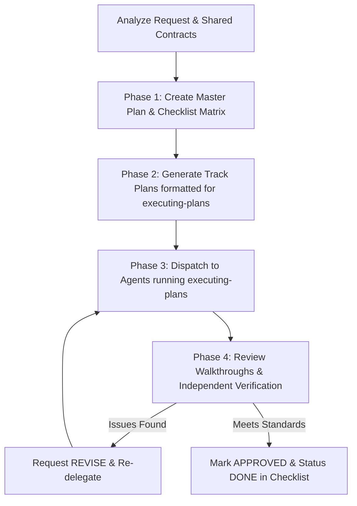

# Agent Task Delegation & Review

Orchestrate and delegate multi-track implementations to external agents (e.g., OpenCode, subagents). This skill leverages **`writing-plans`** to produce decoupled track implementation plans directly executable by external agents via **`executing-plans`**, tracks overall progress through a master checklist, and enforces strict quality gates.

---

## 1. Storage Paths (Aligned with `writing-plans`)

All planning and delegation artifacts are stored under the persistent project plan directory:
- **Base Directory**: `local/agents/brainstorming/plans/`
- **Master Plan / Checklist**: `local/agents/brainstorming/plans/YYYY-MM-DD-<feature-name>.md`
- **Track Plans (Task Specs)**: `local/agents/brainstorming/plans/task_spec_<track>.md` (e.g., `task_spec_be.md`, `task_spec_fe.md`)
- **Walkthrough Artifacts**: `local/agents/brainstorming/plans/<track>_walkthrough.md`

---

## 2. Core Principles

1. **Native Compatibility with `executing-plans`**:
   - External agents use `executing-plans` to implement tasks. Therefore, track task specs are formatted natively as `writing-plans` implementation plans with granular, checkbox-driven TDD steps (`- [ ] Step 1: ...`).
2. **Decoupling & Shared Contracts**:
   - Define contracts (DTOs, REST endpoints, schemas, events) upfront in the Master Plan so tracks (Backend, Frontend, etc.) can execute in **parallel** without blocking dependencies.
3. **Self-Contained Track Specs**:
   - Each track spec contains concrete file targets (`[NEW/MODIFY]`), code snippets, non-negotiable constraints, and verification commands. Zero placeholders.
4. **Mandatory Walkthrough Protocol**:
   - Completing a track requires generating `<track>_walkthrough.md` with terminal logs (exit code 0). Without this artifact, the task is incomplete.
5. **Principal Reviewer Role**:
   - Act as Tech Lead: inspect `git diff`, re-run verification commands independently, and issue an **APPROVED** or **REVISE** decision.

---

## 3. Workflow



### Phase 1: Create Master Plan & Checklist Matrix
Create `local/agents/brainstorming/plans/YYYY-MM-DD-<feature-name>.md` using `writing-plans`. Include the **Task Delegation Matrix**:

```markdown
### Task Delegation Matrix

| Task ID | Track / Scope | Assigned Agent | Track Plan (Task Spec) | Status | Walkthrough Artifact | Review Status |
| :---: | :--- | :---: | :--- | :---: | :--- | :---: |
| **TASK-01** | Backend API & DAO | OpenCode Agent | `task_spec_be.md` | `PENDING` | `be_walkthrough.md` | `PENDING` |
| **TASK-02** | Frontend & UI | OpenCode Agent | `task_spec_fe.md` | `PENDING` | `fe_walkthrough.md` | `PENDING` |
```

### Phase 2: Generate Track Plans (`task_spec_<track>.md`)
Generate track plans using `references/task_spec_template.md`. Because the receiving agent executes using **`executing-plans`**, each track plan must follow the `writing-plans` format:
1. **Goal & Architecture Constraints** (Zero $N+1$, type-safety, backward compatibility).
2. **Shared Contracts & Interfaces** (DTOs, JSON models).
3. **Proposed File Changes** (`[NEW/MODIFY]` with exact paths and code patterns).
4. **Detailed Tasks** (Granular steps with checkboxes `- [ ] Step 1: Write failing test`, `- [ ] Step 2: Implement`, `- [ ] Step 3: Verify`).
5. **Verification Commands & Walkthrough Directive** (Outputs to `local/agents/brainstorming/plans/<track>_walkthrough.md`).

### Phase 3: Dispatch to External Agents
Dispatch to external agents configured with `executing-plans`:
```text
Execute the implementation plan at:
local/agents/brainstorming/plans/task_spec_<track>.md
Using the executing-plans workflow.

Requirements:
1. Follow the task checkboxes, strict TDD loop, and technical constraints.
2. Ensure all verification commands exit with code 0.
3. MANDATORY: Generate local/agents/brainstorming/plans/<track>_walkthrough.md with terminal verification logs before finishing.
```

### Phase 4: Review & Quality Gate
Upon receiving `<track>_walkthrough.md`:
1. **Walkthrough Check**: Verify all checkboxes and tasks were completed, and review terminal logs.
2. **Diff Inspection**: Run `git status` and `git diff` to inspect code changes against Clean Code standards.
3. **Independent Verification**: Re-run build and test commands locally.
4. **Verdict**:
   - **APPROVED**: Update task status to `DONE` in the master checklist.
   - **REVISE**: Detail the issues and instruct the agent to fix them.

---

## 4. Bundled Templates

- [Track Plan / Task Spec Template](references/task_spec_template.md) (Fully compatible with `writing-plans` & `executing-plans`)
- [Walkthrough Template](references/walkthrough_template.md)
- [Checklist Template](references/checklist_template.md)
