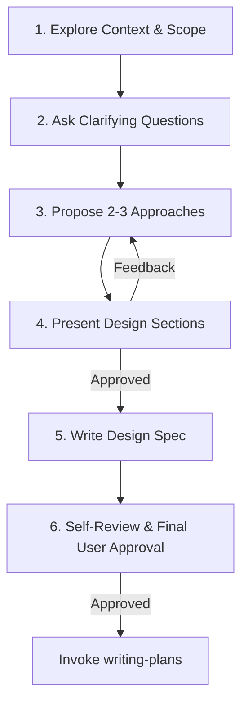

# Brainstorming & Design

Explore user intent, define system architecture, and finalize design specifications through iterative, collaborative dialogue before writing any implementation code.

<HARD-GATE>
Do NOT write code, scaffold projects, or execute implementation skills until the design proposal is presented and explicitly approved by the user.
</HARD-GATE>

---

## Process Overview

---

## Execution Steps

### 1. Explore Context & Scope
- Inspect workspace files, existing docs, and project structure to align with existing architecture.
- **Decompose if needed:** If the request spans multiple independent subsystems, decompose it into smaller sub-projects and brainstorm the first one.

### 2. Ask Clarifying Questions
- Ask **one targeted question at a time** (preferably multiple-choice).
- Clarify core goals, technical constraints, success criteria, and edge cases.

### 3. Propose 2-3 Approaches
- Present 2 to 3 technical solutions detailing pros, cons, and trade-offs.
- Highlight the **recommended option** with clear technical justification.

### 4. Present & Validate Design
- Present design incrementally across key areas (Architecture, Component Boundaries, Data Flow, Error Handling, Testing).
- Validate design sections with the user before finalizing.

### 5. Document Spec & Self-Review
- Write final design spec to `docs/brainstorming/specs/YYYY-MM-DD-<topic>-design.md`.
- **Inline Self-Review:** Check for placeholders (`TODO`/`TBD`), internal contradictions, ambiguous requirements, or YAGNI scope creep. Fix inline immediately.
- Present spec path to user for final review and sign-off.

### 6. Hand-off
- Upon final user approval, invoke the `writing-plans` skill to generate the implementation plan.
