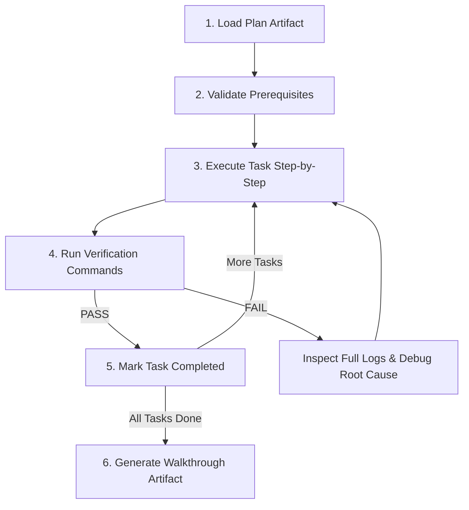

# Executing Plans

Execute an approved implementation plan task-by-task with strict verification, empirical log checking, and walkthrough documentation.

<HARD-GATE>
Do NOT mark a task as complete without gathering concrete, empirical runtime verification (passing tests, clean logs, or working build).
</HARD-GATE>

---

## Process Overview

---

## Execution Protocol

### Step 1: Load Plan & Validate Prerequisites
- Load `implementation_plan.md` or the target plan file.
- Verify target files exist and environment prerequisites are met before starting.

### Step 2: Task Execution & TDD
For each task in the plan:
1. Mark task status to `in_progress`.
2. Follow steps precisely: write test -> verify failure -> implement minimal logic -> verify pass.
3. Keep edits scoped strictly to the task requirements to prevent unintended side effects.

### Step 3: Empirical Verification & Error Handling
- **Inspect Logs on Failure:** If a test or build fails, fetch and inspect the full un-truncated error log immediately.
- **No Masking:** Never resolve errors by returning dummy fallbacks, commenting out broken assertions, or swallowing exceptions. Trace and fix the root cause.

### Step 4: Update Plan Progress
- Mark completed checkboxes (`- [x]`) in the plan artifact upon verifying each task.

### Step 5: Walkthrough Artifact & Completion
Upon completing all tasks:
- Generate or update `<appDataDir>/brain/<conversation-id>/walkthrough.md`.
- Include:
  - Concise summary of completed changes
  - Empirical verification results (test suite output, build success logs)
  - Markdown links to modified files
