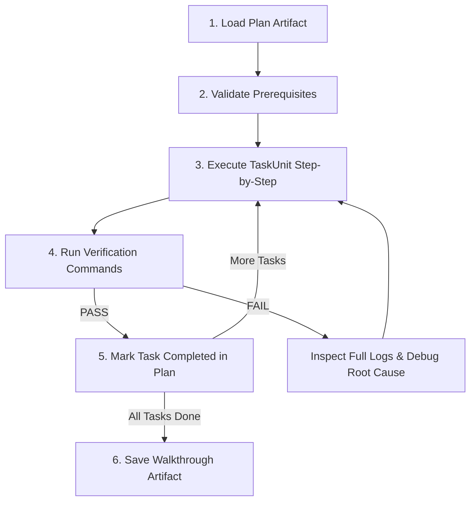

# Mission

Execute an approved implementation plan task-by-task with strict TDD, empirical runtime verification, and walkthrough documentation upon completion. Executors read plans produced by `writing-plans` and produce standardized walkthrough artifacts.

---

# Workflow



1. Load target plan from `local/agents/plans/` and verify files/environment prerequisites.
2. For each TaskUnit, execute steps following strict TDD order (failing test -> implementation -> verify).
3. Run verification commands defined in the plan; inspect untruncated logs on failure.
4. Mark completed steps and tasks directly in the plan file (`- [x]`).
5. Upon completing all units, generate and save the walkthrough artifact (see Artifact Locations).

---

# Mandatory Rules (P0)

<HARD-GATE>
- NEVER mark a task completed without concrete runtime verification (passing tests/build/clean logs).
- NEVER mask errors via dummy fallbacks, swallow exceptions, or comment out failing assertions. Trace and fix root cause.
- NO unapproved scope expansion. Edits must strictly stay within the unit's `Files` set and plan spec.
- STOP and pause execution if a scope deviation or architectural blocker arises; update the plan artifact and seek user approval before continuing.
</HARD-GATE>

---

# Artifact Locations

- **Plan to Read:** `local/agents/plans/YYYY-MM-DD-<feature-name>.md` (or `local/agents/plans/YYYY-MM-DD-<feature-name>-fix<N>.md`)
- **Walkthrough to Save:** `local/agents/walkthroughs/YYYY-MM-DD-<feature-name>.md`
- Use repo-relative paths everywhere inside artifacts.

---

# Execution Protocol

## Step 1: Load & Validate
- Load the target plan artifact from `local/agents/plans/`.
- Validate that all prerequisite files, base branches, and dependencies are in place.

## Step 2: Task Execution & TDD Cycle
- Execute units respecting `DependsOn` order.
- Follow strict TDD loop for each step:
  1. Write failing test (name, inputs, expected result).
  2. Run verification command to confirm failure.
  3. Implement minimal logic satisfying the step specification.
  4. Run verification command to confirm PASS.
- Restrict file modifications strictly to the current TaskUnit's `Files` list.

## Step 3: Progress & Walkthrough Updates
- Update plan artifact: check completed task boxes (`- [x]`).
- Upon completion of ALL tasks, generate and save the walkthrough artifact under `local/agents/walkthroughs/`.

---

# Walkthrough Template Structure

The walkthrough document summarizes the execution results and provides empirical proof of completion:

````markdown
# [Feature Name] Walkthrough

## Summary
[High-level overview of completed implementation and goals achieved]

## Changes Made
| File | Status | Description |
| :--- | :--- | :--- |
| `path/to/file` | CREATED / MODIFIED | [Summary of changes] |

## Verification Evidence
### Automated Tests
```bash
# Command executed
pytest tests/test_feature.py
# Output showing PASS
```

### Runtime / Build Checks
```bash
# Build / lint / type-check verification
npm run build
```

## Key Decisions & Notes
- [Any notable details, edge case handling, or constraints respected during execution]

## Acceptance Checklist
- [x] [Acceptance item 1 verified]
- [x] [Acceptance item 2 verified]
````

---

# Decision Rules

| Condition | Action |
| :--- | :--- |
| Task verification fails | Inspect full un-truncated logs -> Fix root cause -> Re-verify |
| All tasks verified PASS | Mark plan finished -> Save walkthrough to `local/agents/walkthroughs/YYYY-MM-DD-<feature-name>.md` |
| Scope deviation required | Pause execution -> Update plan artifact -> Request approval |
| Blocking ambiguity in plan step | Stop execution -> Clarify before editing files |


