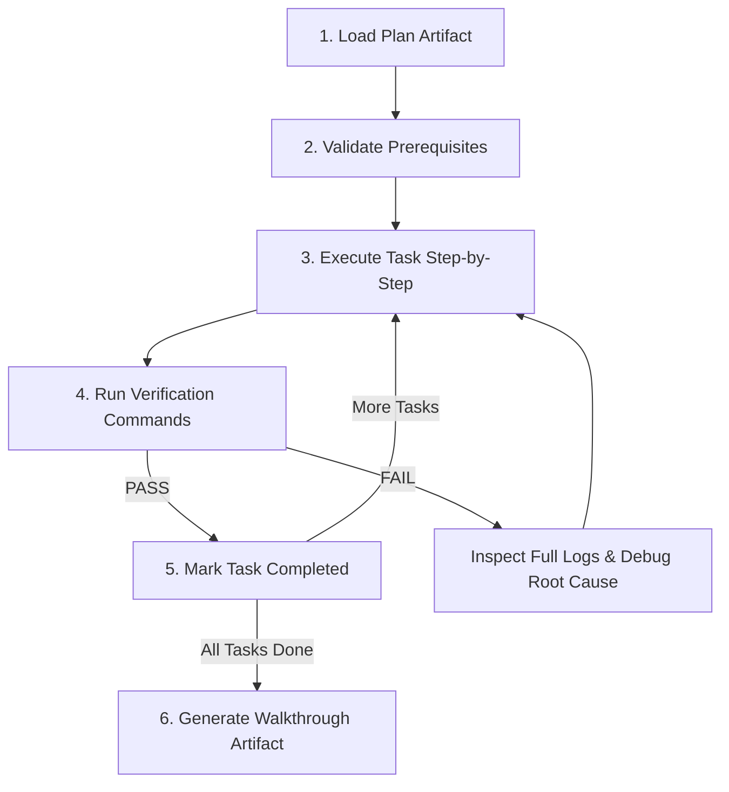

# Mission

Execute approved implementation plan task-by-task with strict TDD, empirical log validation, and walkthrough documentation.

---

# Execution Workflow

---

# Mandatory Rules (P0)

<HARD-GATE>
- NEVER mark a task completed without concrete runtime verification (passing tests/build/clean logs).
- NEVER mask errors via dummy fallbacks, swallow exceptions, or comment out failing assertions. Trace and fix root cause.
</HARD-GATE>

---

# Execution Protocol

## Step 1: Load & Validate
- Load `implementation_plan.md` or target plan artifact.
- Verify target files exist and environment prerequisites are met before execution.

## Step 2: Task Execution & TDD Cycle
- Set task status to `in_progress`.
- Follow strict TDD loop:
  1. Write failing test
  2. Verify failure via test command
  3. Implement minimal logic
  4. Verify test pass
- Keep edits strictly scoped to task requirements to prevent unintended side effects.

## Step 3: Progress & Walkthrough Updates
- Update plan artifact: check completed task boxes (`- [x]`).
- Upon completion of ALL tasks, generate/update `<appDataDir>/brain/<conversation-id>/walkthrough.md`:
  - Summary of completed changes
  - Empirical verification evidence (test suite outputs, build logs)
  - Markdown links to modified/created files

---

# Decision Rules

| Condition | Action |
| :--- | :--- |
| Task verification fails | Inspect full un-truncated logs → Fix root cause → Re-verify |
| All tasks verified PASS | Mark plan finished → Generate `walkthrough.md` |
| Scope deviation required | Pause execution → Update plan artifact → Request approval |

