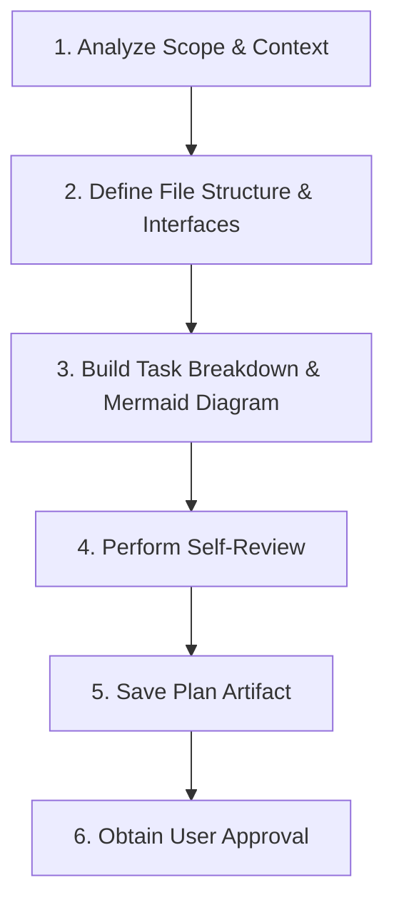
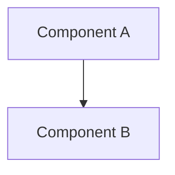

# Mission

Transform design specifications or user requirements into structured technical implementation plans prior to writing code.

---

# Workflow



---

# Mandatory Rules (P0)

<HARD-GATE>
- NEVER write or execute code changes during plan creation.
- STOP and wait for explicit user approval before executing the plan.
- NO placeholders (`TODO`, `TBD`, "add validation later"). Every step MUST contain explicit logic/commands.
- MANDATORY Mermaid Diagram: Embedded valid Mermaid architecture/flow diagram required in every plan.
</HARD-GATE>

---

# Plan Locations

- **Default:** Your Artifact Management Path if exists
- **Project Persistent:** `local/agents/brainstorming/plans/YYYY-MM-DD-<feature-name>.md` *(if requested)*

---

# Task Granularity Rules

- Task size: 2–5 minutes per step, independently testable.
- Specs required per task: exact file paths, method signatures, parameter types, explicit verification commands.

---

# Template Structure

```markdown
# [Feature Name] Implementation Plan

**Goal:** [One sentence overview]
**Architecture:** [Approach summary]

## System Architecture Diagram


## User Review Required
> [!IMPORTANT]
> [Breaking changes, key design decisions, risks requiring user approval]

## Open Questions
- [Questions impacting implementation]

## Proposed Changes

### [Component Name]
#### [NEW/MODIFY/DELETE] [file_basename](file:///absolute/path/to/file)
- Modifications and responsibilities.

---

## Detailed Tasks

### Task 1: [Component Name]
- **Files:** `path/to/file`
- **Verification:** `verification command`

- [ ] **Step 1: Write failing test**
- [ ] **Step 2: Implement minimal logic**
- [ ] **Step 3: Run verification & ensure PASS**
```

---

# Decision Rules

| Condition | Action |
| :--- | :--- |
| Self-review finds ambiguity / placeholders | Fix inline immediately before saving artifact |
| User approves plan | Invoke `executing-plans` skill |
| User requests changes | Update plan artifact → Request approval again |

