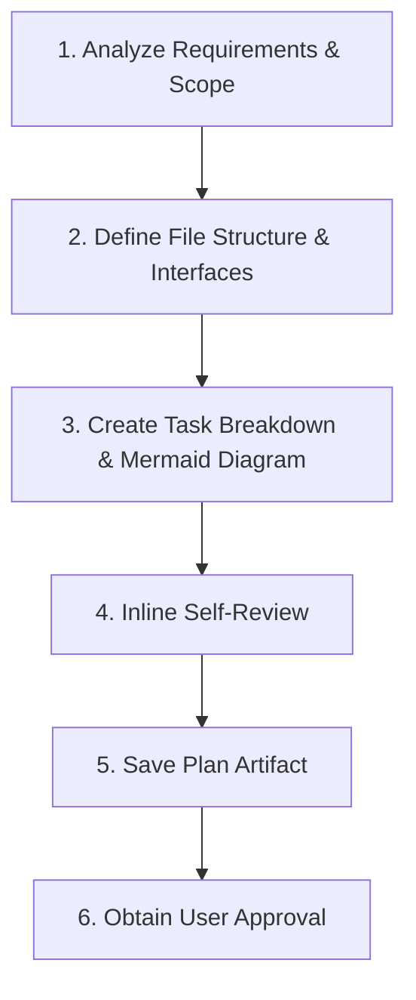
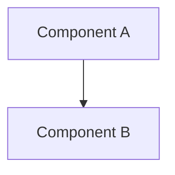

# Writing Implementation Plans

Transform design specifications or user requirements into a structured, step-by-step technical implementation plan before touching code.

<HARD-GATE>
Do NOT write code or execute code changes during plan creation. Present the completed plan to the user and wait for explicit approval.
</HARD-GATE>

---

## Process Overview



---

## Plan Artifact Location

- **Primary Path:** `<appDataDir>/brain/<conversation-id>/implementation_plan.md`
- **Project-Level Path:** `docs/brainstorming/plans/YYYY-MM-DD-<feature-name>.md` *(if project-level persistence is requested)*

---

## Core Guidelines

### 1. Task Right-Sizing & Granularity
- Break work into bite-sized, independently testable tasks (2–5 minutes per step).
- Specify exact file paths, method signatures, parameter types, and explicit verification commands.

### 2. No Placeholders (Strict Policy)
- Never write `TODO`, `TBD`, "add validation later", or vague descriptions.
- Include complete code snippets and exact test/build commands for every step.

### 3. Mandatory Mermaid Diagram Integration
- **REQUIRED SUB-SKILL:** Use the `mermaid` skill to embed valid Mermaid diagrams (architecture, sequence, flowcharts, or component diagrams) inside every implementation plan.

---

## Plan Template Structure

```markdown
# [Feature Name] Implementation Plan

**Goal:** [One sentence describing what this feature builds]
**Architecture:** [Short summary of the approach]

## System Architecture Diagram


## User Review Required
> [!IMPORTANT]
> [Highlight breaking changes, key design choices, or risks requiring explicit user sign-off.]

## Open Questions
- [Any clarifying questions that impact implementation.]

## Proposed Changes

### [Component Name]

#### [NEW/MODIFY/DELETE] [file_basename](file:///absolute/path/to/file)
- Specific modifications and responsibilities.

---

## Detailed Tasks

### Task 1: [Component/Module Name]
- **Files:** `exact/path/to/file.py`
- **Verification:** `pytest tests/path/to/test.py`

- [ ] **Step 1: Write failing test / test case**
- [ ] **Step 2: Implement minimal code logic**
- [ ] **Step 3: Run verification and verify PASS**
```

---

## Self-Review & Handoff

1. **Self-Review:** Scan plan inline for missing spec requirements, placeholders, syntax errors in Mermaid diagrams, or type mismatches. Fix inline immediately.
2. **Handoff:** Present the plan artifact path to the user. Once approved, invoke the `executing-plans` skill to execute.
