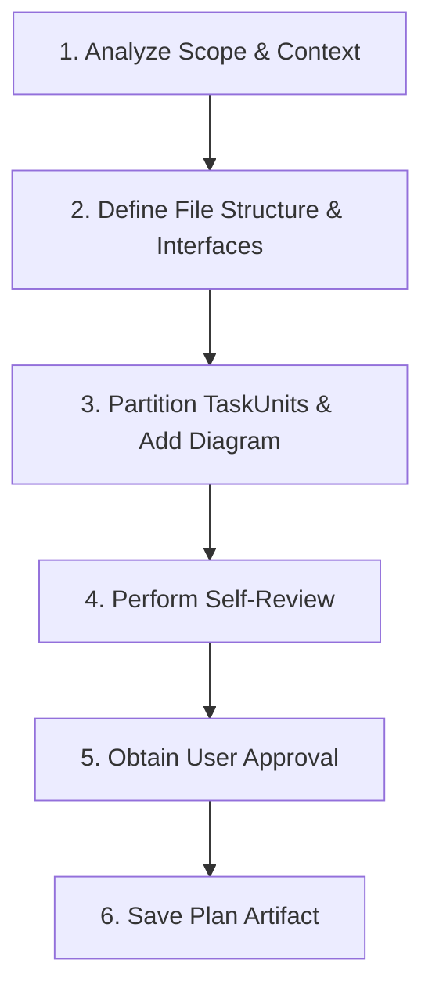
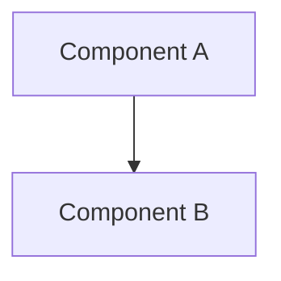

# Mission

Transform design specifications or user requirements into a structured, self-sufficient implementation plan prior to writing code. This skill is the SINGLE source of truth for plan format: planners write to it, reviewers check against it, builders execute it.

---

# Workflow



1. Use provided analysis (`FileContexts`, constraints, invariants); read code only to fill gaps.
2. Decide exact files, signatures, and types.
3. Group work into TaskUnits per Partitioning Rules; draw the diagram.
4. Run the Self-Review Checklist and fix issues inline.
5. Present for approval using the calling agent's checkpoint format (if none: AffectedFiles table, one line per unit, 3-6 key changes). Nothing is saved yet.
6. Save the approved plan (see Plan Locations).

---

# Mandatory Rules (P0)

<HARD-GATE>
- NEVER write or execute code changes during plan creation. The only file ever written is the plan artifact, and only after approval.
- STOP and wait for explicit user approval before saving the plan and before any execution.
- NO placeholders (`TODO`, `TBD`, "add validation later"). Every step MUST contain explicit logic/commands.
- MANDATORY Mermaid Diagram: embedded valid Mermaid architecture/flow diagram in every plan.
- `Open Questions` MUST be resolved (ask the user) before approval. A saved plan states `None`.
- The plan MUST be self-sufficient: the executor has no analyzer and will not rediscover scope. Use exact repo-relative paths and line ranges.
</HARD-GATE>

---

# Partitioning Rules

- At most 5 TaskUnits; a small change may be a single unit.
- Unit `Files` sets are DISJOINT; every `AffectedFiles` entry belongs to exactly one unit.
- `DependsOn` is `none` or a list of unit IDs. It must be acyclic and used only for real ordering (e.g. one unit produces an interface another consumes). Maximize units that can run in parallel.
- Every unit has a non-empty `Spec` and `Verify`; every file in its `Files` appears in at least one step.
- A step MUST NOT touch a file outside its unit's `Files`.

---

# Step Granularity

- Step size: 2-5 minutes, independently testable.
- Each step names: exact file path, method signature with parameter and return types, and the logic.
- Express logic as precise prose or pseudocode/signature snippets (max ~15 lines). Complete implementations are the executor's job.
- Test-first where behavior is testable: failing test (name, inputs, expected result) -> minimal logic -> verification.
- `Verify` lists exact commands with the expected result.

---

# Plan Locations

- **Plan:** `local/agents/plans/YYYY-MM-DD-<feature-name>.md` (kebab-case name)
- **Fix Plan** (from a work review): `local/agents/plans/YYYY-MM-DD-<feature-name>-fix<N>.md`, containing only the files that need changes
- Use repo-relative paths everywhere inside the plan.

---

# Template Structure

Headings `Goal`, `AffectedFiles`, `TaskUnits`, `Spec`, `Verify`, `Acceptance` (and unit fields `Files`, `DependsOn`) are parsed by the builder. Never rename or omit them.

````markdown
# [Feature Name] Implementation Plan

## Goal
[One sentence overview]

## Scope
- In: [...]
- Out: [...]

## Architecture
[Approach summary]



## User Review Required
> [!IMPORTANT]
> [Breaking changes, key design decisions, risks requiring user approval, or "None"]

## Open Questions
None

## AffectedFiles
| File | Action | Why |
| :--- | :--- | :--- |
| `path/to/file` | NEW / MODIFY / DELETE | [reason] |

## Constraints
- [Limits the executor must respect]

## Conventions
- [Naming, style, patterns to follow]

## TaskUnits

### U1: [Component Name]
- **Files:** `path/to/file`, `path/to/other`
- **DependsOn:** none
- **Spec:**
  - [ ] **Step 1:** `path/to/file` (L10-40) - write failing test `name`: input -> expected
  - [ ] **Step 2:** `path/to/file` - implement `Type method(ParamType p)`: [logic]
  - [ ] **Step 3:** run verification and ensure PASS
- **Verify:** `verification command` -> [expected result]

### U2: [Component Name]
- **Files:** `path/to/another`
- **DependsOn:** U1
- **Spec:**
  - [ ] **Step 1:** ...
- **Verify:** `verification command` -> [expected result]

## Acceptance
- [ ] [Observable, checkable criterion]

## Risks
- [Risk and mitigation]
````

---

# Self-Review Checklist

- No placeholders or ambiguous wording anywhere.
- Partitioning Rules satisfied (disjoint files, acyclic `DependsOn`, <= 5 units).
- Every `AffectedFiles` entry has at least one step; no step touches a file outside its unit.
- Signatures and types are consistent across units that share an interface.
- Every `Acceptance` item is covered by at least one `Verify`.
- Mermaid diagram is valid and matches the units.
- `Open Questions` is `None`.

---

# Decision Rules

| Condition | Action |
| :--- | :--- |
| Self-review finds ambiguity / placeholders | Fix inline immediately before presenting |
| `Open Questions` not empty | Ask the user, merge answers, then continue |
| Independent review returns `CHANGES_REQUIRED` | Fix the draft and re-review |
| User approves plan | Save artifact, reply with the path, hand off to the executor (`builder` agent) |
| User requests changes | Update the draft -> request approval again |